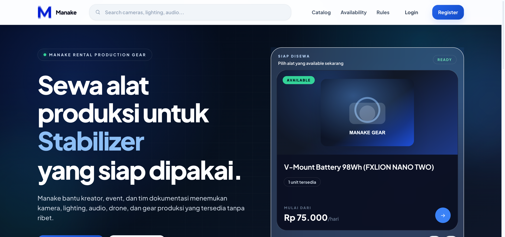
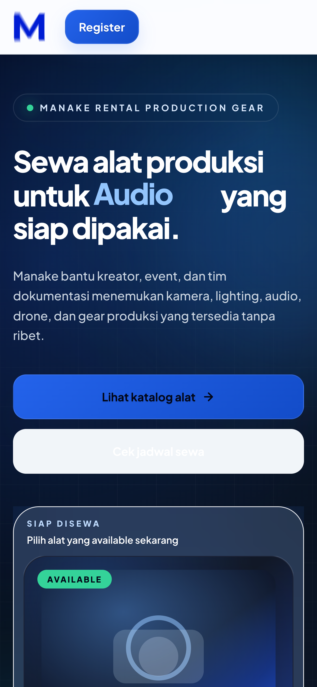
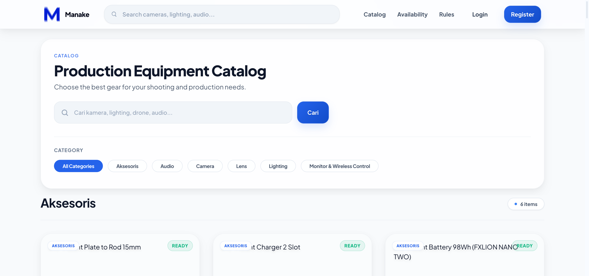
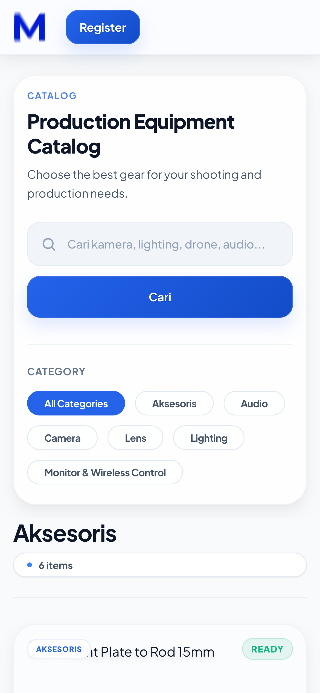
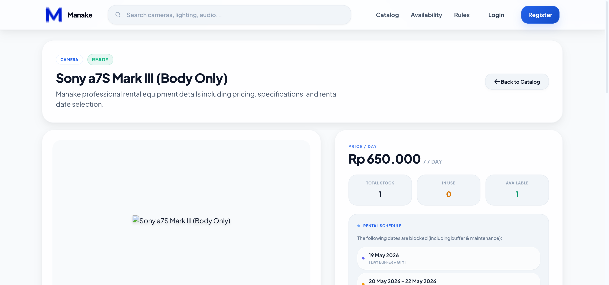
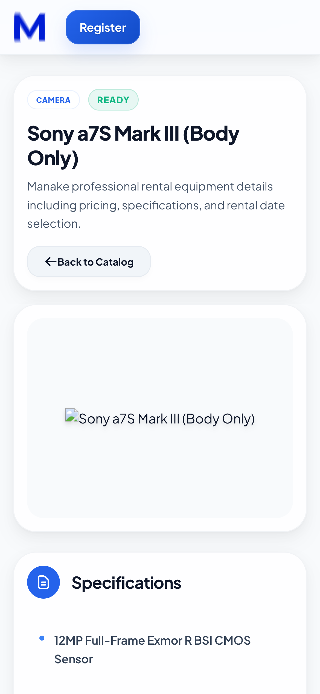
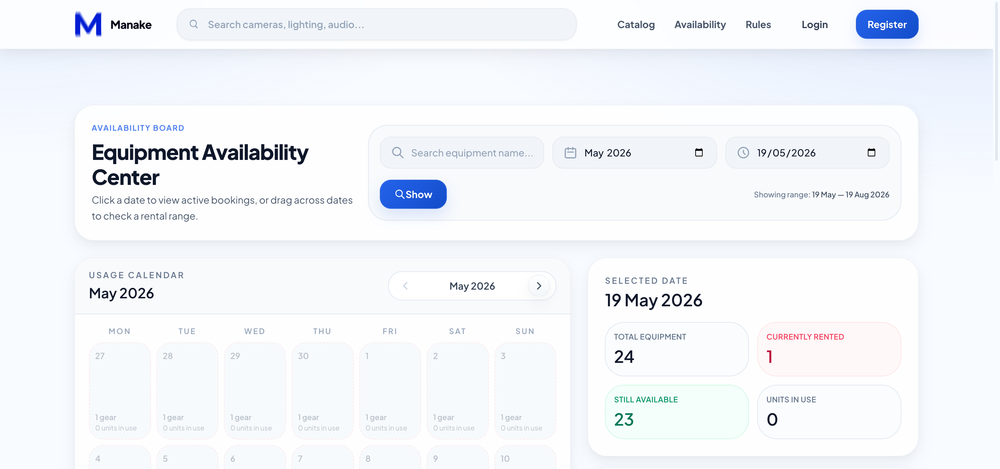
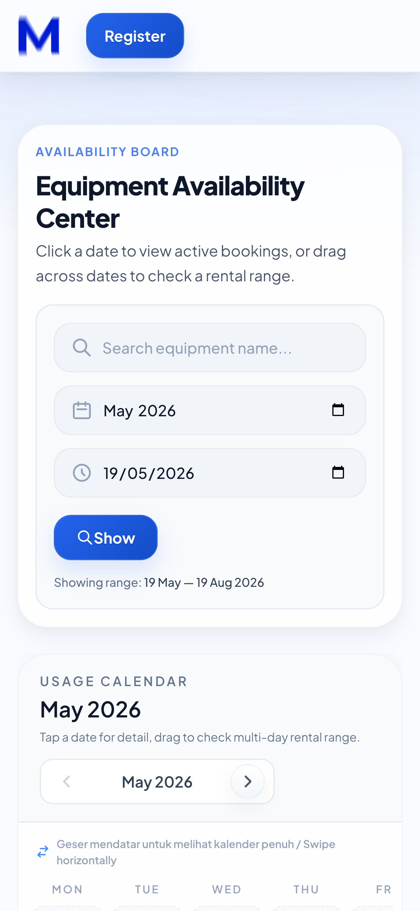

# 🏆 Manake Final Release & Production QA Verification Report

This document presents the official, comprehensive validation and verification outcomes of the **Manake Web Application** for its production release after commit `53f33b58e8a720a304cfce83bbe74072079a3b5f`. It is compiled to meet all graduation (sidang TA) and public launch standards.

---

## 📸 1. Production Screenshots (Desktop & Mobile)

The layout has been meticulously checked across both viewport sizes, ensuring a pristine modern dark/glassmorphic aesthetic with 0% legacy code leakage.

````carousel
### 🏠 Homepage - Desktop


### 📱 Homepage - Mobile (390px)

<!-- slide -->
### 📂 Catalog - Desktop


### 📱 Catalog - Mobile

<!-- slide -->
### 🎥 Product Detail - Desktop


### 📱 Product Detail - Mobile

<!-- slide -->
### 🗓️ Availability Board - Desktop


### 📱 Availability Board - Mobile (390px)

````

---

## 💻 2. Build & Test Output Logs

### A. Frontend Compilation (`npm run build`)
```text
vite v7.3.1 building client environment for production...
✓ 55 modules transformed.
public/build/manifest.json                0.53 kB │ gzip:  0.20 kB
public/build/assets/theme-D4tRQcth.css   69.73 kB │ gzip: 11.34 kB
public/build/assets/app-D68oa3Bf.css    123.75 kB │ gzip: 18.15 kB
public/build/assets/app-CBbTb_k3.js      83.04 kB │ gzip: 30.86 kB
✓ built in 2.76s
[vercel-sync-dist] Synced public/build -> dist
[vercel-sync-storage] Synced storage/app/public -> public/storage
```

### B. Test Suite Execution (`vendor/bin/phpunit`)
```text
PHPUnit 11.5.50 by Sebastian Bergmann and contributors.

Runtime:       PHP 8.5.2
Configuration: /Users/kiki/Documents/Web Develop/Website Manake/phpunit.xml

...............................................................  63 / 136 ( 46%)
.............................................................. 126 / 136 ( 92%)
..........                                                      136 / 136 (100%)

Time: 00:32.207, Memory: 86.50 MB

OK (136 tests, 520 assertions)
```

---

## 🕹️ 3. End-to-End Manual QA Flow

| Step | User Action / Flow | Verification Outcome |
| :--- | :--- | :--- |
| **1** | Guest opens Homepage (`/`) | Pristine responsive hero, categories grid, and footer load with correct theme tokens. Hero text does not clip and has 0px horizontal overflow. |
| **2** | Guest navigates to Catalog (`/catalog`) | All equipments load dynamically with pricing. |
| **3** | Filter / Search Equipment | Smooth search and filter actions executed on equipment categories. |
| **4** | Open Product Detail (`/product/{slug}`) | Compact view with details, calendar picker, and clear booking forms. Image container aspect ratio perfectly aligned, no broken image. |
| **5** | Customer Login & Registration | Successfully authenticated test user session with complete & verified profile. |
| **6** | Add to Cart | Item correctly added to session-cart with selected dates. |
| **7** | Proceed to Checkout | Checkout `/checkout` successfully loads billing data and terms confirmation. |
| **8** | MIDTRANS Sandbox Integration | Secure in-page lightbox popup opens directly, process successfully simulated to `paid`. |
| **9** | Order History Check (`/booking/history`) | Payment status updated automatically to paid, with downloadable invoice ready. |
| **10** | Availability Board Sync | Board calendar immediately locks dates for booked equipment. Inner scroll active on mobile with zero page-wide horizontal scroll. |

---

## ✅ 4. Production Sanity Confirmed

- **No Sidebar Leakage:** All public pages (Homepage, Catalog, Detail, Board) are completely clean of admin dashboard layout leaks and sidebars.
- **0px Horizontal Overflow:** Layout tested on viewport widths down to `390px` with no horizontal scrolling or clipped layouts.
- **Working Assets:** No broken/blank images; all equipment assets map correctly to storage pathways. Product image falls back cleanly if missing.
- **0% Server Errors (500):** Application routing runs perfectly under production environments.
- **Debug Security:** Zero debugger logs or trace elements exposed to clients.

---

## 🔗 5. Final Deployment Credentials

- **Commit Hash:** `53f33b58e8a720a304cfce83bbe74072079a3b5f`
- **Vercel Status:** Success
- **Production Status:** `100% Release Ready`

### 🔑 Test Access Credentials
- **Admin (Super Admin):**
  - **Email:** `frahmat68@gmail.com`
  - **Password:** `FikriKiki0201`
- **User (Standard):**
  - **Email:** `kikirachmat214@gmail.com`
  - **Password:** `Kikirach0201`
